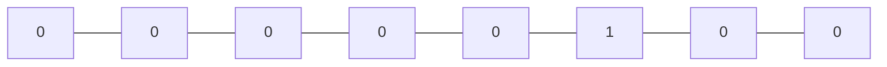
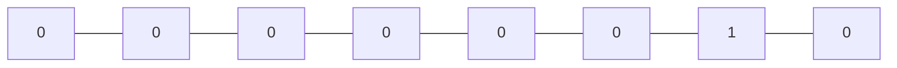
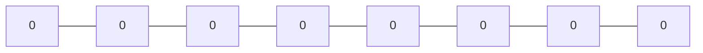

# Basic Bit Manipulation Operations

- ### Get Bit:

We can easily get the value of an $i^{th}$ bit by using left-shift operator `<<` and `&` operator.

Let us consider a 8 bit integer: `00000101`. We have to find the $2^{nd}$ integer i.e `i=2`.


Also, lets right shift `1` by `i` i.e. `1 << i`



Now lets perform `&` operation on above set of bits, we get: `00000101` & `00000100` = `00000100`


The above set of bits is not `0`. So, the $2^{nd}$ bit is `1`.

```cpp
#include<iostream>

int main(){
	int a = 0b101;
	int i = 2;
	int output = a & (1 << i);

	if(output!=0) std::cout << 1;
	else std::cout << 0;
}
```

Output:

```cpp
1
```

We can also achieve the same results by using class template `bitset`.

```cpp
#include <bitset>
#include <iostream>

int main(){
	std::bitset<8> a(0b101);
	std::cout << a[2];
	//Similar: a.test(2);
}
```

- ### Set Bit:

We can easily set the value of an $i^{th}$ bit to `1` by using left-shift operator `<<` and `|` operator.

Let us consider a 8 bit integer: `00000101`. We have to update the $1^{st}$ integer i.e `i=1` to `1`.


Also, lets right shift `1` by `i` i.e. `1 << i`



Now lets perform `|` operation on above set of bits, we get: `00000101` | `00000010` = `00000111`


Now, the $1^{st}$ bit is set to`1`. And the new set of bits is: `00000111`

```cpp
int a = 0b101;
int i = 1;
a |= (1 << i);

//We cannot directly output binary. It gets implicity converted. So we type cast to bitset
std::cout << (std::bitset<8>) a;
```

Output:

```cpp
00000111
```

We can also achieve the same results by using class template `bitset`.

```cpp
#include <bitset>
#include <iostream>

int main(){
	std::bitset<8>a(0b101);
	a.set(1);
	std::cout << a;
	//Output: 00000111
}
```

- ### Clear Bit:

We can easily clear the value of an $i^{th}$ bit to `0` by using left-shift `<<`, not `~` , and `&` operator.

Let us consider a 8 bit integer: `00000101`. We have to clear the $2^{nd}$ integer i.e `i=2` to `0`.


Also, lets right shift `1` by `i` i.e. `1 << i`


Also, lets perform NOT operator on the above bits. i.e `~00000100` = `11111011


Now lets perform `&` operation on above set of bits and our original set of bits, we get: `11111011` & `00000101` = `00000001`


Now, the $2^{nd}$ bit is set to`0`. And the new set of bits is: `00000001`

```cpp
int a = 0b101;
int i = 2;
a &= ~(1 << i);

//We cannot directly output binary. It gets implicity converted. So we type cast to bitset
std::cout << (std::bitset<8>) a;
```

Output:

```cpp
00000001
```

We can also achieve the same results by using class template `bitset`.

```cpp
#include <bitset>
#include <iostream>

int main(){
	std::bitset<8>a(0b101);
	a.reset(2);
	std::cout << a;
	//Output: 00000001
}
```

- ### Update Bit:

We can easily update the value of an $i^{th}$ bit to `K` by using clear bit and set bit like above.

Let us consider a 8 bit integer: `00000101`. We have to update the $2^{nd}$ integer i.e `i=2` to `K = 0`.


First we will clear the $i^{th}$ bit. So, lets right shift `1` by `i` i.e. `1 << i`


Also, lets perform NOT operator on the above bits. i.e `~00000100` = `11111011`


Now lets perform `&` operation on above set of bits and our original set of bits, we get: `11111011` & `00000101` = `00000001`


Now we have to perform set bit. Lets left shift `K` which is either `0` or `1` in this case **0** by `i`. i.e `K << i`



Now perform OR operation on above two sets of bits i.e `00000001` | `00000000` = `00000001`


Now, `0` is set on $2^{nd}$ position.

```cpp
int a = 0b101, i = 2, K = 0;

a = (K << i) | (a & ~(1 << i));

//We cannot directly output binary. It gets implicity converted. So we type cast to bitset
std::cout << (std::bitset<8>) a;
```
