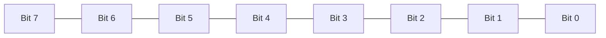
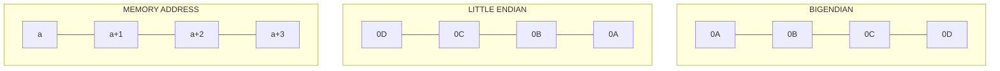

# Bit Manipulation

An algorithmic operation known as **bit manipulation** involves the manipulation of bits at the bit level (bitwise). Bit manipulation is all about these bitwise operations. They improve the efficiency of programs by being primitive, fast actions.

## Basic Understanding of how C++ compilers assign bits to memory

There are different data types that occupy different size of memory.

The following diagram shows 8 bits (1 byte) memory.

The left most bit is the Most Significant Bit (MSB) and the right most bit is the Least Significant Bit (LSB).

The MSB is also a sign bit in signed data type.

## Endianness

**Endianness** is the order or sequence of bytes of a word of digital data in memory.

Endianness is primarily expressed as big-endian (BE) or little-endian (LE). 

- A big-endian system stores the most significant byte of a word at the smallest memory address and the least significant byte at the largest. 
- A little-endian system, in contrast, stores the least-significant byte at the smallest address.

Bi-endianness is a feature supported by numerous computer architectures that feature switchable endianness in data fetches and stores or for instruction fetches. 

Other orderings are generically called middle-endian or mixed-endian.

These two diagrams show how two computers using different endianness store a 32-bit (four byte) integer with the value of 0x0A0B0C0D. 

In both cases, the integer is broken into four bytes, 0x0A, 0x0B, 0x0C, and 0x0D, and the bytes are stored in four sequential byte locations in memory, starting with the memory location with address a, then a + 1, a + 2, and a + 3. 
