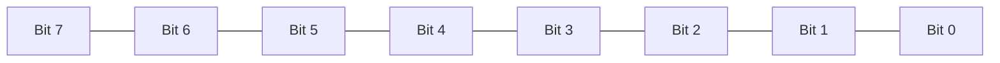

# Bit Manipulation

An algorithmic operation known as **bit manipulation** involves the manipulation of bits at the bit level (bitwise). Bit manipulation is all about these bitwise operations. They improve the efficiency of programs by being primitive, fast actions.

## Basic Understanding of how C++ compilers assign bits to memory

There are different data types that occupy different size of memory.

The following diagram shows 8 bits (1 byte) memory.

The left most bit is the Most Significant Bit (MSB) and the right most bit is the Least Significant Bit (LSB).

The MSB is also a sign bit in signed data type.

## Endianness

**Endianness** is the order or sequence of bytes of a word of digital data in memory.

Endianness is primarily expressed as big-endian (BE) or little-endian (LE). 
