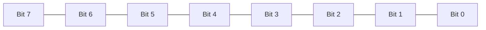
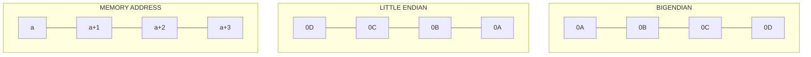
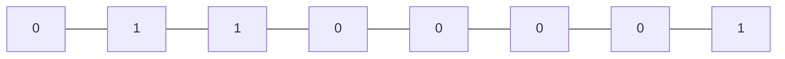

# Bit Manipulation

An algorithmic operation known as **bit manipulation** involves the manipulation of bits at the bit level (bitwise). Bit manipulation is all about these bitwise operations. They improve the efficiency of programs by being primitive, fast actions.

## Basic Understanding of how C++ compilers assign bits to memory

There are different data types that occupy different size of memory.

The following diagram shows 8 bits (1 byte) memory.



The left most bit is the Most Significant Bit (MSB) and the right most bit is the Least Significant Bit (LSB).

The MSB is also a sign bit in signed data type.

## Endianness

**Endianness** is the order or sequence of bytes of a word of digital data in memory.

Endianness is primarily expressed as big-endian (BE) or little-endian (LE). 

- A big-endian system stores the most significant byte of a word at the smallest memory address and the least significant byte at the largest. 
- A little-endian system, in contrast, stores the least-significant byte at the smallest address.

Bi-endianness is a feature supported by numerous computer architectures that feature switchable endianness in data fetches and stores or for instruction fetches. 

Other orderings are generically called middle-endian or mixed-endian.

These two diagrams show how two computers using different endianness store a 32-bit (four byte) integer with the value of 0x0A0B0C0D. 



In both cases, the integer is broken into four bytes, 0x0A, 0x0B, 0x0C, and 0x0D, and the bytes are stored in four sequential byte locations in memory, starting with the memory location with address a, then a + 1, a + 2, and a + 3. 

The difference between big- and little-endian is the order of the four bytes of the integer being stored.

The right-side diagram shows a computer using big-endian. This starts the storing of the integer with the most-significant byte, 0x0A, at address a, and ends with the least-significant byte, 0x0D, at address a + 3.

The left-side diagram shows a computer using little-endian. This starts the storing of the integer with the least-significant byte, 0x0D, at address a, and ends with the most-significant byte, 0x0A, at address a + 3.

Since each computer uses its same endianness to both store and retrieve the integer, the results will be the same for both computers. Issues may arise when memory is addressed by bytes instead of integers, or when memory contents are transmitted between computers with different endianness.

Big-endianness is the dominant ordering in networking protocols, such as in the Internet protocol suite, where it is referred to as network order, transmitting the most significant byte first. Conversely, little-endianness is the dominant ordering for processor architectures (x86, most ARM implementations, base RISC-V implementations) and their associated memory.

### Fun Fact::

In the 1726 novel Gulliver's Travels, he portrays the conflict between sects of Lilliputians divided into those breaking the shell of a boiled egg from the big end or from the little end. Because the emperor's son had cut his finger while opening an egg from the big end, doing so was prohibited by an imperial edict; those who rebelled and did so were called "Big-Endians" (Swift did not use the term Little-Endians in the work).

## Signed 8-Bit Integers

```cpp
int8_t a = 97;
//Same as char a = 97; or signed char a = 97
```

The binary equivalent of `97` is : `01100001`

So variable `a` is stored in memory like this.



And when we retrieve the value from the memory it gets converted to its desired value.

 $0^{7}$ +  $2^{6}$ +  $2^{5}$ +  $0^{4}$ +  $0^{3}$ +  $0^{2}$ +  $0^{1}$ +  $2^{0}$  = 97
 
 It is a signed bit, so the left most bit is the sign bit. It is 0 which means positive.
 
 Lets say if the left most bit was `1` like below.
 
 ```mermaid
graph LR
    A[1] --- B[1]
    B --- C[1]
    C --- D[0]
    D --- E[0]
    E --- F[0]
    F --- G[0]
    G --- H[1]
```

Then the sign is negative like this.

 -$2^{7}$ +  $2^{6}$ +  $2^{5}$ +  $0^{4}$ +  $0^{3}$ +  $0^{2}$ +  $0^{1}$ +  $2^{0}$  = -31
 
 ### 8-bit Integer implicit type conversion
 
 ```cpp
int8_t a = 97;
std::cout << a;
```

Output:

```cpp
a
```

Here we can see that the output is not `97` but `a`. This is because the compiler implicitly converts any 8 bit data type which has integer into their equivalent ASCII value.

We can avoid that by using `static_cast` and converting 8 bit data type to any other higher bit data type.

```cpp
int8_t a= 97;
std::cout << static_cast<int>(a);
```

Output:

```cpp
97
```

## Unsigned 8-Bit Integers

The only difference unsigned integers have is that MSB doesn't represent a sign bit.

```cpp
uint8_t a = 97;
//Same as unsigned char a = 97
```

The binary equivalent of `97` is : `01100001`

So variable `a` is stored in memory like this.


And when we retrieve the value from the memory it gets converted to its desired value.

 $0^{7}$ +  $2^{6}$ +  $2^{5}$ +  $0^{4}$ +  $0^{3}$ +  $0^{2}$ +  $0^{1}$ +  $2^{0}$  = 97
 
 Lets say if the left most bit was `1` like below.
