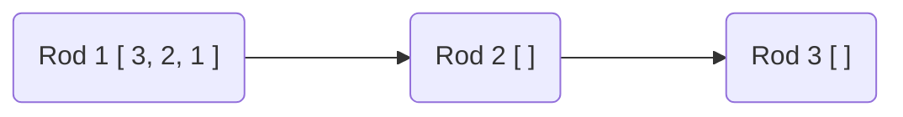
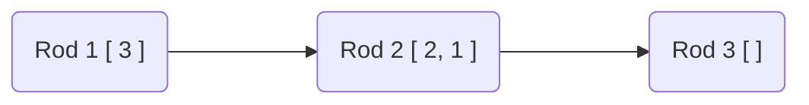
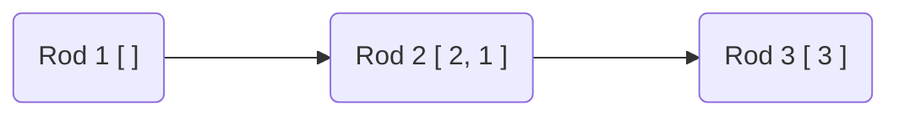
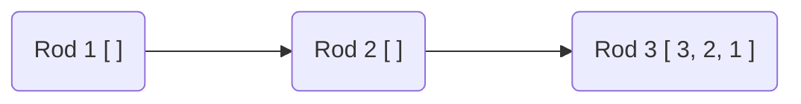

# Tower of Hanoi
Tower of Hanoi is a mathematical puzzle where we have three rods and n disks. The objective of the puzzle is to move the entire stack to another rod, obeying the following simple rules:

- Only one disk can be moved at a time.
- Each move consists of taking the upper disk from one of the stacks and placing it on top of another stack i.e. a disk can only be moved if it is the uppermost disk on a stack.
- No disk may be placed on top of a smaller disk.

## Approach



The above diagram represents the initial state of tower of Hanoi. Three discs (1,2,3) are present in rod 1. Rod 2 and 3 are empty.

We solve the tower for `n-1` discs.

First we move `n-1` discs to Rod 2. The diagram looks like this.



Then we move  the biggest disc from Rod 1 to Rod 3. The diagram looks like this.



Then we move all `n-1` discs from Rod 2 to Rod 3. The diagram looks like this.



In this way Tower of Hanoi can be solved.


## Solution


1.  Initially, the `hanoi` function is called with `n = 3`, representing three disks to be moved from the starting rod (1) to the ending rod (3).
    
2.  The `hanoi` function checks the base case where `n` is equal to 1. If true, it directly moves the disk from the starting rod to the ending rod and returns.
    
3.  In the recursive case, the `hanoi` function calculates the middle rod (mid) based on the starting and ending rods. For a three-rod setup, the middle rod can be calculated as `6 - (start + end)`.
    
4.  The `hanoi` function is then called recursively with `n-1` disks to be moved from the starting rod to the middle rod. This is visualized as the first recursive call in the diagram above.
    
5.  After the recursive call, the function prints the movement of the disk from the starting rod to the ending rod.
    
6.  Next, another recursive call to `hanoi` is made with `n-1` disks to be moved from the middle rod to the ending rod. This is visualized as the second recursive call in the mermaid diagram.
    
7.  The recursion continues until the base case is reached, which corresponds to moving a single disk directly from the starting rod to the ending rod.
    
8.  As the recursive calls return, the function backtracks and completes the remaining movements of disks based on the intermediate rod.
    

By following this recursive approach, the `hanoi` function systematically solves the Tower of Hanoi problem by moving the disks from the starting rod to the ending rod while adhering to the rules of the puzzle.


## Complexity

Time Complexity : $O [ 2^n ]$

Space Complexity : $O [ 1 ]$

## Code

```cpp
#include<iostream>

void hanoi(int N, int start, int end){
	if(N==1){
		std::cout << "Moved from "<<start<<" to "<<end<<std::endl;
		return;
	}

	int mid = 6 - (start + end);
	hanoi(N-1,start,mid);
	std::cout << "Moved from " << start << " to " << end << std::endl;
	hanoi(N-1,mid,end);
}

int main(){	
	hanoi(3,1,3);
	return 0;
}
	
```
