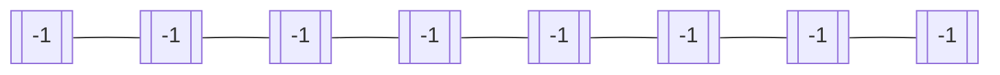
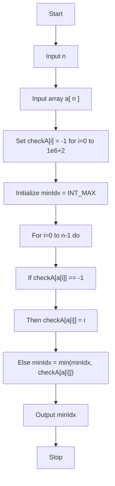

# First-repeating element
###  Amazon, Oracle Interview Question

- ## Problem
	Given an array **a[]** of size **n**. The task is to find the first repeating element in an array of integers, i.e., an element that occurs more than once and whose index of first occurrence is smallest.

- ## Input
	
	7

	1 5 3 4 3 5 6

- ## Output
	
	The sum of elements from 2nd position to 4th position is 12
		
	`` 1``
	
- ## Constraints

	1 <= n <= $10^{6}$
	
	0 <= Ai <=  $10^{6}$

- ## Solution

	-	####  Approach

		To solve the first repeating element question using a check array, we need to iterate through the given array of size n and initialize a check array of size m with all elements set to -1. Then, we iterate through each element of the given array and check if the element is already present in the check array by accessing the index corresponding to the element value. If the value at that index is not equal to -1, then we have found the first repeating element, and we return that value. Otherwise, we set the value at that index to the current element value. If we finish iterating through the array and no repeating element is found, we return -1.

		The check array is used to keep track of which elements have already been seen while iterating through the given array. By initializing it with all values set to -1, we can easily check if an element has been seen before by checking if the value at the corresponding index is not equal to -1.

		First make a check array of size $10^{6}$ + 2
		
		``int checkA[N]``

		Then fill the check array with -1



Now loop the array from **i=0** to **i=n-1**

Now fill check array at $i^{th}$ element of the array with **i**. i.e.

``checkA[a[i]] = i;``

We also have to check if the check array is not -1. If it is not -1,we have to keep track of the minimum index.

``if(checkA[a[i]] != -1) minIdx = std::min(minIdx,checkA[a[i]]);``

We can solve the problem by looping over the array from **i=0** to **n-1**

Overall time complexity: **O [ n ]**
		

#### Flow Chart


-	## Code
```cpp
#include <climits>
#include <iostream>

int main() {
  int n;
  std::cin >> n;

  int a[n];
  for (int i = 0; i < n; i++) {
    std::cin >> a[i];
  }

  int N = 1e6 + 2;
  int checkA[N];

  for (int i = 0; i < N; i++) {
    checkA[i] = -1;
  }

  int minIdx = INT_MAX;

  for (int i = 0; i < n; i++) {
    if (checkA[a[i]] == -1) {
      checkA[a[i]] = i;
    } else {
      minIdx = std::min(minIdx, checkA[a[i]]);
    }
  }

  std::cout << minIdx;
}
```
