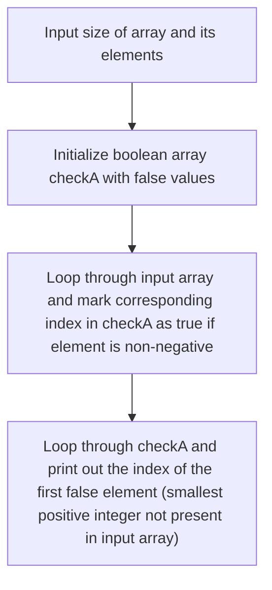

# Smallest Positive Missing Number
###  Amazon, Samsung, Snap Deal, Accolite Interview Question

## Problem

Find the smallest positive missing number in the given array.

Example:  

**[0, -10, 1, 3, -20]**

**Ans = 2**

## Input
	
6

0, -9, 1, 3, -4, 5


## Output
	
		
`` 2``
	
## Constraints

1 <= n <= $10^{6}$
	
0 <= A~i~ <=  $10^{6}$

## Solution

- ####  Approach

	First  we initialize a Boolean array `checkA` of size `1e6 + 2` with all elements set to false.
	
	Next, we loops through the elements in the input array `a` and marks the corresponding index in `checkA` as true if the element is non-negative.
	
	Finally, we loops through the `checkA` array and print out the index of the first false element, which represents the smallest positive integer that is not present in the input array.
		

## Flow Chart


## Code
```cpp
#include <iostream>

int main() {
  int n;
  std::cin >> n;

  int a[n];
  for (int i = 0; i < n; i++) {
    std::cin >> a[i];
  }

  int N = 1e6 + 2;
  bool checkA[N];

  for (int i = 0; i < N; i++) {
    checkA[i] = 0;
  }

  for (int i = 0; i < n; i++) {
    if (a[i] >= 0) checkA[a[i]] = 1;
  }

  for (int i = 0; i < N; i++) {
    if (checkA[i] == 0) {
      std::cout << i;
      break;
    }
  }
}
```
