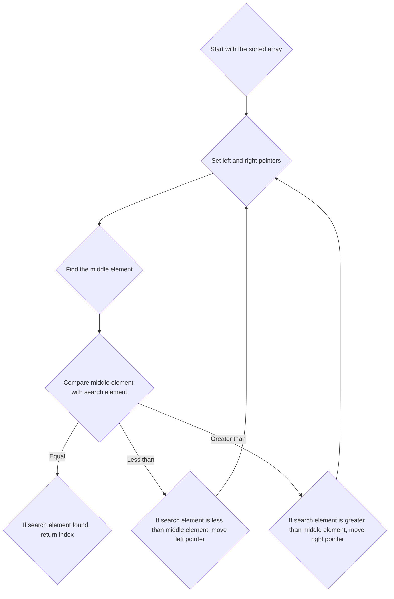

# Binary Search
## Time Complexity : O [ logn ]

We find the middle index. Then compare the middle element with the given number. If the middle number is greater than the given number, then we can ignore right side of the array and vice versa.
This way we reduce the size of the array by half in a single operation.

In an array **a** with **n** elements i.e. **a[n]** we have to find the index of given number **K**
Let **a[7]** = {6,8,12,18,42,99,102}
To find **12** in **a**:
- First find the mid-index, i.e **mid = n/2**
- Let the left-pointer **lp = 0** and right-pointer **rp = n - 1**
- Loop until **a[mid] == K** or until left pointer equals or exceeds right pointer i.e **lp >=rp**
- If **a[mid]** is greater than **K** i.e **a[mid] > K**, then change the right pointer i.e **rp=mid - 1**
- If **a[mid]** is less than **K** i.e **a[mid] < K**, then change the left pointer i.e **lp = mid + 1**
- Update mid, i.e **mid = (lp + rp) / 2**

Now, **mid** is the index of **K**


### Solution


```
#include <iostream>

int main(){
        //Question : In an array arr of size n, find the index of k.
        //Take array input and find k.

        int n;
        std::cin >> n;

        int k;
        std::cin >> k;

        int arr[n];
        for(int i=0;i<n;i++){
                std::cin >> arr[i];
        }

        //Now perform a binary search

        int lp=0, rp = n-1;
        int mid;
        mid = (lp + rp) / 2;

        while(arr[mid]!=k){
                mid = (lp + rp) / 2;
                if(arr[mid] > k) rp = mid - 1;
                else if(arr[mid] < k) lp = mid + 1;

        }

        std::cout << mid;
        return 1;
}
```

## Solution Diagram


