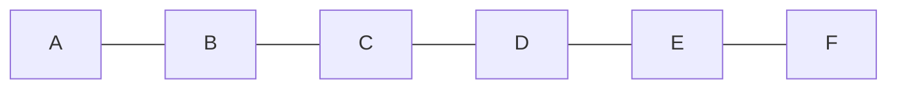

# Character Array

Character array is an array where characters are stored in each index.

The following is a character array.



## Declaration of Character arrays

Character Arrays are declared similar to integer arrays but with an additional 1 byte size.

Syntax: 
```cpp
char arr[N+1]`
```
The additional 1 byte at the end of the array is to store a null byte `\0` that indicates end of the word.

In C++, each word after a space is stored in separate variables. To store an entire sentence in a variable, we have to use `getline` function.

```cpp
cin.getline(arr, N);
```
