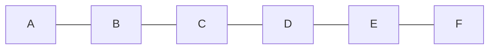

# Character Array

Character array is an array where characters are stored in each index.

## Declaration of Character arrays

Character Arrays are declared similar to integer arrays but with an additional 1 byte size.

Syntax: 
