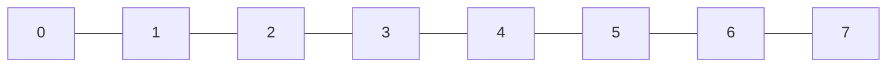
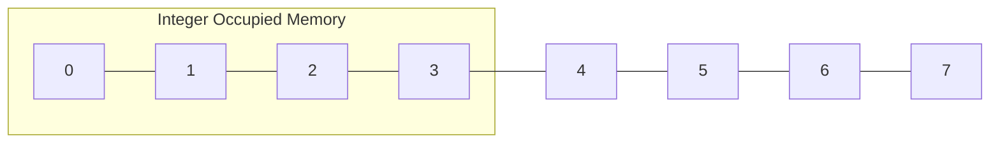
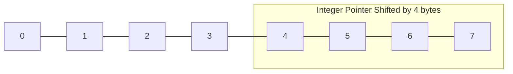

# Pointers

Pointers are variables that store the memory address of other variables

## Getting Started

**&** operator gives the memory address of the variable.

For example:
```cpp
int a = 20;
std::cout << &a;
```

The above code outputs some address in hexadecimal.  `0x7ffefae2ef2c` 

**Dereference Operator** $(*)$ :  An interesting property of pointers is that they can be used to access the variable they point to directly. This is done by preceding the pointer name with the dereference operator (*).

For example:
int a = 20;
int *aptr = &a;
std::cout << *aptr;
```

The above code outputs value stored at `aptr` i.e.  `20`

## Changing values using pointers

We can update the values in a variable by using pointers.

Normally we change the value in a variable by declarling like this.

```cpp
int a=20;
a=30;
```

However, we can also update the value of a variable using pointers like this.
```cpp
int a=20;
int *aptr = &a;
*aptr = 30;
```

## Pointer Arithmetic
We can perform basic operations (addition and subtraction) on a pointer.

The diagram below represnts a block of memory. Each block represents a single byte of memory.


Let us say we store a integer in a variable.

```cpp
int a = 20;
```
Integer occupies 4 bytes of memory. So the variable `a` occupies 4 bytes of memory.



Let us make a pointer that points to the above memory address.

```cpp
int *aptr = &a;
```

Now we perform addition on the pointer.

```cpp
aptr++;
```

What happens is that the the pointer doesnt shift 1 byte but 4 bytes. The reason is that it leaves 4 bytes of memory for the integer data type and occupies the next 4 bytes of memory.



Similarly we can shift the pointer left and right by subtraction and addition respectively.

**Note**: The data type declared for pointers should be the same as the data type of the value stored in the variable.

## Pointers and Arrays

Arrays work very much like pointers to their first elements, and, , an array access can always be implicitly converted to a pointer access of the appropriate type.

For example:

```cpp
int a[] = {1,2,3};
std::cout << a ;
```
The output of the above code would be `0x7ffe6dfdca20` because `a` points to the first element in the array.

By using dereference operator, we can get the first element.
