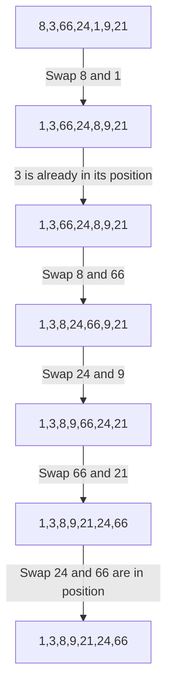

# Sorting
### Sorting means arranging the elements in a certain order. In this chapter, we will be sorting numbers in an array in an ascending order.

There are different sorting methods.
- Selection Sort
- Bubble Sort
- Insertion Sort

## Selection Sort

### Time Complexity : O [$e^{2}$]
In a selection sort, we find the minimum element in the array and swap it with the current element.
Let an array **a** of size **n**
Let **a[7] = {8,3,66,24,1,9,21}**

We have to use two loops.
First traverse from **0** to **n-2** and in the inner loop traverse from **1 to n-1**
Find the minimum element and swap with the current active element.



### Code
```
#include <iostream>

int main(){
    int n;
    std::cin >> n;

    int a[n];
    for(int i=0;i<n;i++){
        std::cin >> a[i];
    }

    for(int i=0;i<n-1;i++){
        int minIdx = i;
        for(int j=i+1;j<n;j++){
            if(a[j] < a[minIdx]){
                minIdx = j;
            }
        }
        
        int temp = a[i];
        a[i] = a[minIdx];
        a[minIdx] = temp;
    }
    
    for(int i=0;i<n;i++){
        std::cout << a[i] << " ";
    }

    return 0;
}

```

## Bubble Sort

### Time Complexity : O[$n^{2}$]

In bubble sort, we find the compare two elements and swap the maximum element to the right. This way the maximum element gets pushed to the right most side.

Let an array **a** of size **n**
Let **a[7] = {8,3,66,24,1,9,21}**

First we loop array **a** from **i=0** to **i=n-2**. In the inner loop we loop from **j=i** to **j=n-1**

| Pass | Array | Swapped Elements |
| --- | --- | --- |
| Initial | 8 3 66 24 1 9 21 | - |
| 1 | 3 8 24 1 9 21 66 | 3 and 24 |
| 2 | 3 1 8 9 21 24 66 | 1 and 8<br>24 and 9 |
| 3 | 1 3 8 9 21 24 66 | 8 and 1<br>66 and 24 |
| 4 | 1 3 8 9 21 24 66 | - |

### Code

```
#include <iostream>

int main(){
	int n;
	std::cin >> n;
	int a[n];
	for(int i=0;i<n;i++){
		std::cin >> a[i];
	}
	
	int counter = n-1;

	while(counter > 0){
		for(int i=0;i<counter;i++){
			if(a[i] > a[i+1]) {
				int temp = a[i];
				a[i] = a[i+1];
				a[i+1] = temp;
				}
		}
		counter--;
	}

	for(int i=0;i<n;i++){
		std::cout << a[i] << " ";
	}
	return 1;
}
```

## Insertion Sort
In insertion sort, we consider the first element to be sorted. Then we take the second element and insert it in its place in a sorted array i.e either before or after the first element. Now the two elements are sorted. This way we insert each element in its place in the sorted array and shift the other elements.
### Time Complexity : O[$n^{2}$]
Let an array **a** of size **n**
Let **a[7] = {8,3,66,24,1,9,21}**

- First we loop array **a** from **i=1** to **i=n-1**.
- Then we keep track of current element i.e **curr = a[i]**
- Lets keep track of the element just behind i.e **j=i-1**
- Loop while the previous element is greater than current element i.e. **a[j] > curr && j >=0**
  - Swap the previous element with the current element i.e. **a[j+1] = a[j]**
  - Decrease j i.e. **j--**
- Now when we are out of loop, we are now in our desired position. So replace the element in  **a[j+1]** with the current element i.e **a[j+1] = curr**

### Table Explaination :

| **Initial Array** | **Sorted Array** | **Explanation** |
| --- | --- | --- |
| 8 3 66 24 1 9 21 | 3 8 66 24 1 9 21 | The first element, 8, is already in the correct place |
| 3 8 66 24 1 9 21 | 3 8 66 24 1 9 21 | The second element, 3, is already in the correct place |
| 3 8 66 24 1 9 21 | 3 8 66 24 1 9 21 | The third element, 66, is already in the correct place |
| 3 8 66 24 1 9 21 | 3 8 24 66 1 9 21 | The fourth element, 24, is smaller than 66, so it is inserted before 66 |
| 3 8 24 66 1 9 21 | 1 3 8 24 66 9 21 | The fifth element, 1, is smaller than 3, so it is inserted before 3 |
| 1 3 8 24 66 9 21 | 1 3 8 9 24 66 21 | The sixth element, 9, is smaller than 24, so it is inserted before 24 |
| 1 3 8 9 24 66 21 | 1 3 8 9 21 24 66 | The seventh element, 21, is smaller than 66, so it is inserted before 66 |

### Code

```
#include <iostream>

int main()
{
  int n;
  std::cin >> n;

  int a[n];
  for (int i = 0; i < n; i++) {
    std::cin >> a[i];
  }

  for (int i = 1; i < n; i++) {
    int curr = a[i];
    int j = i - 1;
    while (a[j] > curr && j >= 0) {
      a[j + 1] = a[j];
      j--;
    }
    a[j + 1] = curr;
  }

  for (int i = 0; i < n; i++) {
    std::cout << a[i] << " ";
  }
  return 1;
}
```
