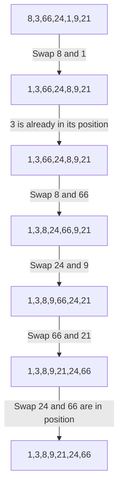

# Sorting
### Sorting means arranging the elements in a certain order. In this chapter, we will be sorting numbers in an array in an ascending order.

There are different sorting methods.
- Selection Sort
- Bubble Sort
- Insertion Sort

## Selection Sort

### Time Complexity : O [$e^{2}$]
In a selection sort, we find the minimum element in the array and swap it with the current element.
Let an array **a** of size **n**
Let **a[7] = {8,3,66,24,1,9,21}**

We have to use two loops.
First traverse from **0** to **n-2** and in the inner loop traverse from **1 to n-1**
Find the minimum element and swap with the current active element.



### Code
```
#include <iostream>

int main(){
    int n;
    std::cin >> n;

    int a[n];
    for(int i=0;i<n;i++){
        std::cin >> a[i];
    }

    for(int i=0;i<n-1;i++){
        int minIdx = i;
        for(int j=i+1;j<n;j++){
            if(a[j] < a[minIdx]){
                minIdx = j;
            }
        }
        
        int temp = a[i];
        a[i] = a[minIdx];
        a[minIdx] = temp;
    }
    
    for(int i=0;i<n;i++){
        std::cout << a[i] << " ";
    }

    return 0;
}

```

## Bubble Sort
In bubble sort, we find the compare two elements and swap the maximum element to the right. This way the maximum element gets pushed to the right most side.

Let an array **a** of size **n**
Let **a[7] = {8,3,66,24,1,9,21}**
