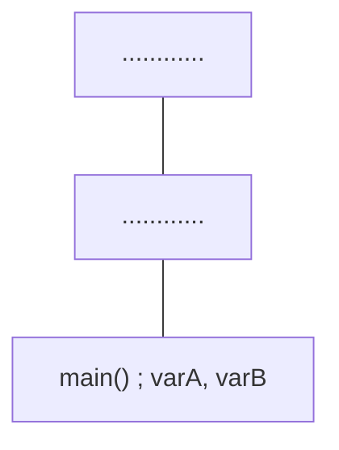
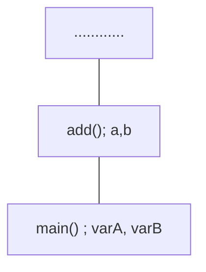
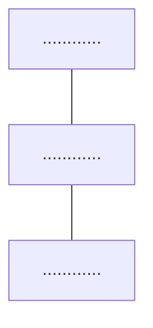

# Dynamic Memory Allocation: Stack and Heap

## Stack Memory Allocation

By default, the memory is is allocated on the function call stack.

The following code has two functions: `main()` and `add()`.

```cpp
int add(int a, int b){
	return a+b;
}
int main(){
	int varA, varB;
	std::cin >> varA >> varB;
	std::cout << add(varA,varB);
	return 0;
}
```

First, the `main` function is called. So it gets added to the function call stack. All the local variables are stored in this stack.



Now, the `add` function is called. So it gets added to the stack.



The functions in the stack get removed in the opposite order in which they were added.

So when `add` function returns, `add` gets removed from the stack.


Now, `main` function returns 0. So it also gets removed from the stack.



**Note :** The size of a memory stack is fixed. It cannot be changed during run-time. When a lot of functions are called, the functions get added to the memory stack. At a certain point, due to extreme recursions or some other reason, the stack may get filled up resulting to **Stack Overflow**

## Heap Memory Allocation

The size of a heap is not fixed. A programmer can assign the size of the heap as big as the virtual memory of the device.
