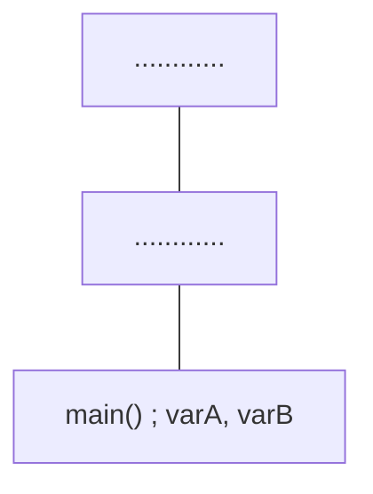
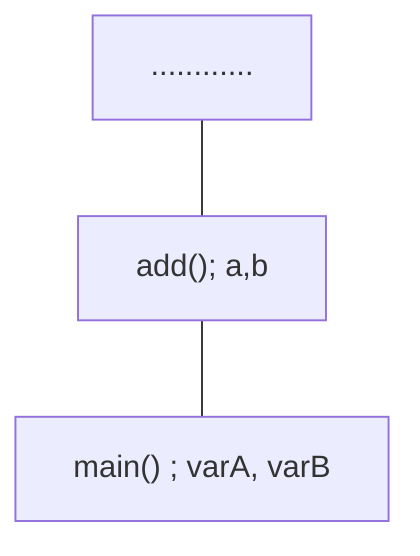
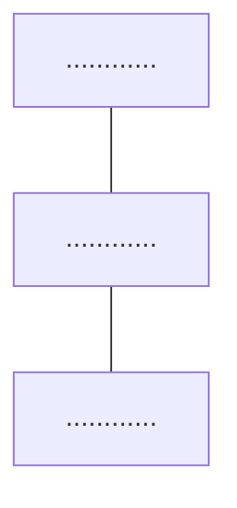

# Dynamic Memory Allocation: Stack and Heap

## Stack Memory Allocation

By default, the memory is is allocated on the function call stack.

The following code has two functions: `main()` and `add()`.

```cpp
int add(int a, int b){
	return a+b;
}
int main(){
	int varA, varB;
	std::cin >> varA >> varB;
	std::cout << add(varA,varB);
	return 0;
}
```

First, the `main` function is called. So it gets added to the function call stack. All the local variables are stored in this stack.



Now, the `add` function is called. So it gets added to the stack.



The functions in the stack get removed in the opposite order in which they were added.

So when `add` function returns, `add` gets removed from the stack.


Now, `main` function returns 0. So it also gets removed from the stack.



**Note :** The size of a memory stack is fixed. It cannot be changed during run-time. When a lot of functions are called, the functions get added to the memory stack. At a certain point, due to extreme recursions or some other reason, the stack may get filled up resulting to **Stack Overflow**

## Heap Memory Allocation

The size of a heap is not fixed. A programmer can assign the size of the heap as big as the virtual memory of the device.

In the following code, the variable `a` gets stored in the memory stack. 

```cpp
int a=10;
```

However, to store the variable in a heap, we have to use the `new` operator.

```cpp
int *a = new int();
*a = 10;
```

In the above code, the value of `a` i.e is stored in heap. However, `a` itself which stores the memory location is stored in stack memory.

In stack memory, allocation and deallocation is managed by the system. However, in heap we have to manually deallocate the memory. 

For that, we have `delete` operator.

We provide the memory location of the heap to the `delete` operator.

```cpp
delete(a);
```

Now, that the value in the heap memory is deallocated, `a` still points to that location in the heap memory which is empty. This is called a **dangling pointer**.

There are two ways to remove dangling pointer.

- Reusing to store other variables
- Assigning `null` value to the pointer.

```cpp
a = NULL;
```
