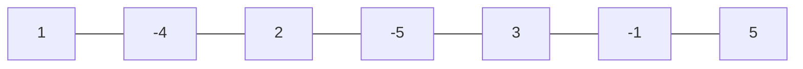

# Maximum Sum Circular Sub array

## Problem

Find the maximum sum in the subarray.

Example:  

**[1, 2, -3, 5, 1]**

**Ans = 9**

## Input
	
7

1 -4 2 -5 3 -1 5

## Output
	
`` 8``

## Solution

- ### Kadanes Algorithm Approach

	The approach is to first find the total sum of the given array, and then find the maximum sum of a non-circular subarray using Kadane's algorithm on the negated array.

	To find the maximum sum of a circular subarray, we subtract the minimum possible subarray sum (i.e., negative of the maximum subarray sum of negated array) from the total sum. We do this because the maximum sum of a circular subarray is either a non-circular subarray or the sum of the remaining elements after excluding the minimum possible subarray sum from the total sum.

	In summary, the algorithm works as follows:

	1.  Find the total sum of the array.
	2.  Negate the elements of the array.
	3.  Find the maximum sum of a non-circular subarray using Kadane's algorithm on the negated array.
	4.  Add the total sum to the maximum sum obtained in step 3 to get the maximum circular subarray sum.
	5.  Return the maximum circular subarray sum.	
	
	**Time Complexity** : O [ n ]
	
## Diagram

