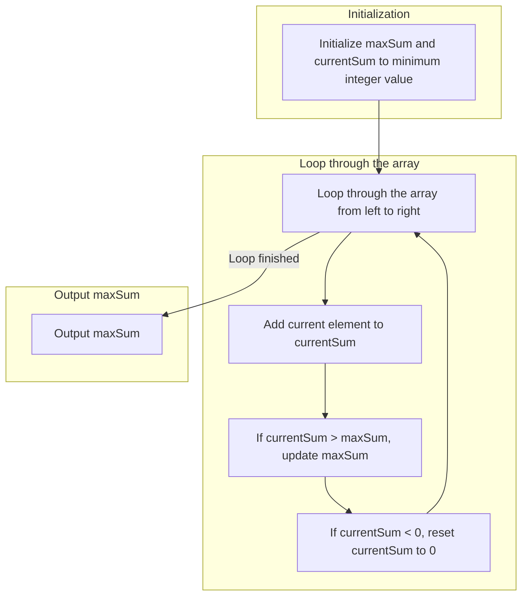

# Maximum Sub Sub array

## Problem

Find the maximum sum in the subarray.

Example:  
**[1, -5, 3, 4, -2]**
**Ans = 7**

## Input
	
7

1 -4 2 -5 3 -1 5

## Output
	
		
`` 7``

## Solution

- ####  Brute Force Approach

	Initialize a variable `max_sum` to the smallest possible integer value.

	Next, loop through each element in the array, and for each element, calculate the sum of all contiguous subarrays that start with that element. To do this, we make a nested loop that starts at the current element and goes up to the end of the array, adding each element to the `sum` variable.

	Inside the nested loop, we also update the `max_sum` variable with the maximum value seen so far between the current `max_sum` and the new `sum`. This ensures that `max_sum` contains the largest sum seen so far in any subarray that starts with any element.

	After the nested loop completes for the current element, it moves to the next element and repeats the same process of finding the maximum sum of subarrays starting from that element.

	**Time Complexity** : O [ $n^{2}$ ]
	
	
- ### Prefix Sum Approach
	
	Initialize an array `cumsum` of size `n+1` to store the prefix sum of the input array. 

	Also initialize a variable `max_sum` to the smallest possible integer value.

	Next, loop through each element in the input array and calculate the prefix sum up to that element. The prefix sum of an element is the sum of all elements from the beginning of the array up to that element. Store the prefix sum in the `cumsum` array.

	After calculating the prefix sum, loop through each possible contiguous subarray in the input array. For each subarray, calculate its sum using the prefix sum values. Subtract the prefix sum value of the first element in the subarray from the prefix sum value of the last element in the subarray. This gives the sum of the elements in the subarray.

	Update the `max_sum` variable with the maximum value seen so far between the current `max_sum` and the new `sum`. This ensures that `max_sum` contains the largest sum seen so far in any subarray.

	**Time Complexity** : O [ $n^{2}$ ]
	
- ### Kadanes Algorithm

	The intuition behind Kadane's algorithm is that if the sum of a subarray becomes negative, there is no reason to include that subarray in any future calculation of the maximum sum. Instead, we can start a new subarray from the next element.
	
	1.  Initialize two variables maxSum minimum integer value. and currentSum to 0.
	2.  Loop through the array from left to right: 
		- Add the current element to the `currentSum` variable. 
		- If the `currentSum` is greater than the `maxSum`, update the `maxSum`. 
		- If the `currentSum` becomes negative, reset it to zero.
	3.  After the loop, the maxSum variable will contain the maximum sum of a subarray in the array.
	
	**Time Complexity** : O [ n ]
	
## Flow Chart


## Code

### 1. Brute Force Method
```
#include <climits>
#include <iostream>

int main() {
  int n;
  std::cin >> n;

  int a[n];
  for (int i = 0; i < n; i++) {
    std::cin >> a[i];
  }

  int max_sum = INT_MIN;
  for (int i = 0; i < n; i++) {
    int sum = 0;
    for (int j = i; j < n; j++) {
      sum += a[j];
      max_sum = std::max(max_sum, sum);
    }
  }

  std::cout << max_sum;
}
```
