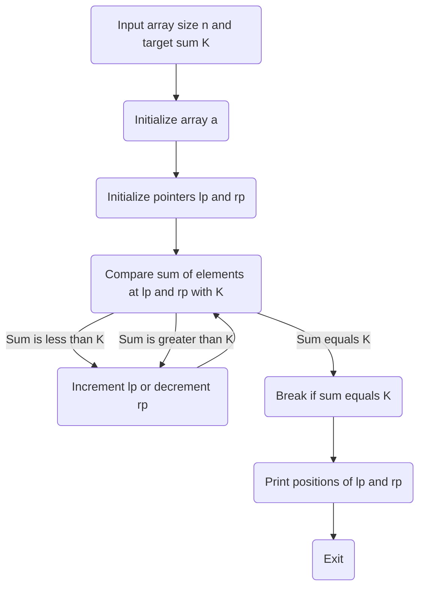

# Pair Target Sum

## Problem

Find whether there exist 2 numbers that sum to K.

Example:  

**[1, 2, -3, 5, 1]**

**Sum = 7**

**Ans = 1   3**

## Input

7

8

1 -4 2 -5 3 -1 5

## Output

`` 4  6``

## Solution

We use two pointers, one at the beginning of the array `lp` and another at the end `rp`. 

Now we check the sum of values at these two pointers.
- If the sum is less than K, then we increments the left pointer `lp` to increase the sum. 
- If the sum is greater than K, then it decrements the right pointer `rp` to decrease the sum. 
- If the sum becomes equal to K, it break out of the loop.

This process continues until the sum is equal to K or there are no more elements left in the array to compare.

The pointers `lp` and `rp` are are the indices of the two numbers whose sum is equal to the target value K.
	
**Time Complexity** : O [ n ]

**Note** : For this approach the array should be sorted. If not then we should first sort the array.

## Flow Chart

## Code
